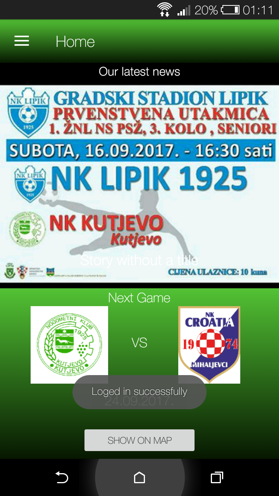
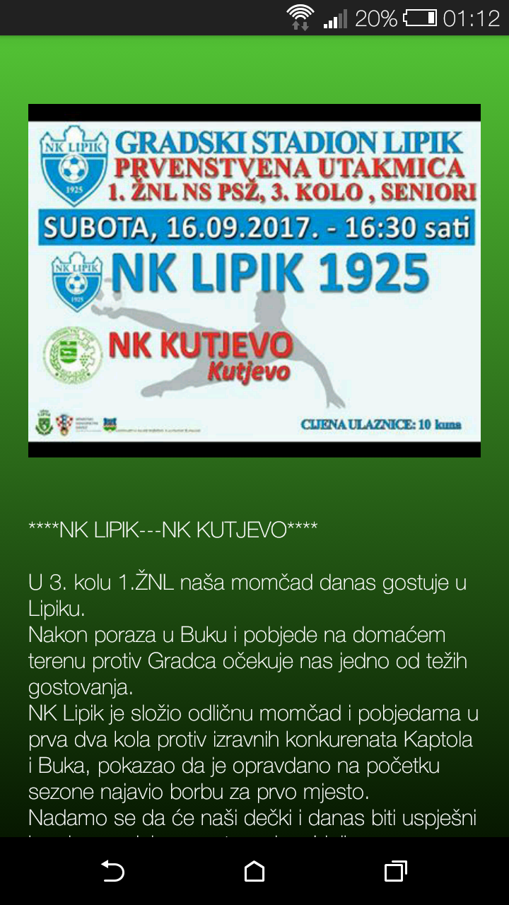
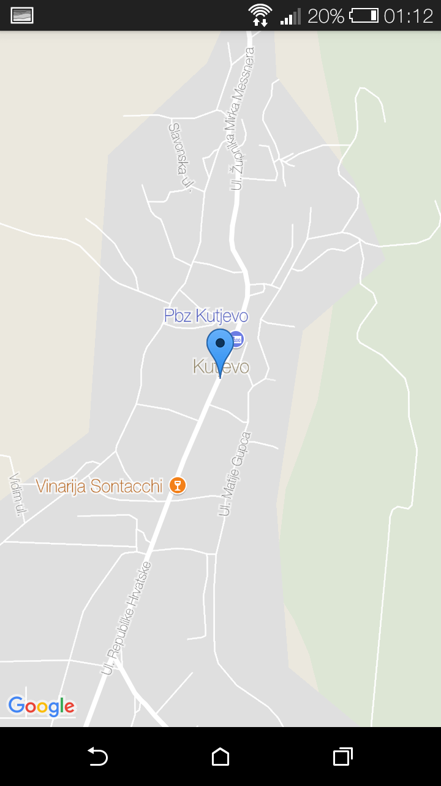
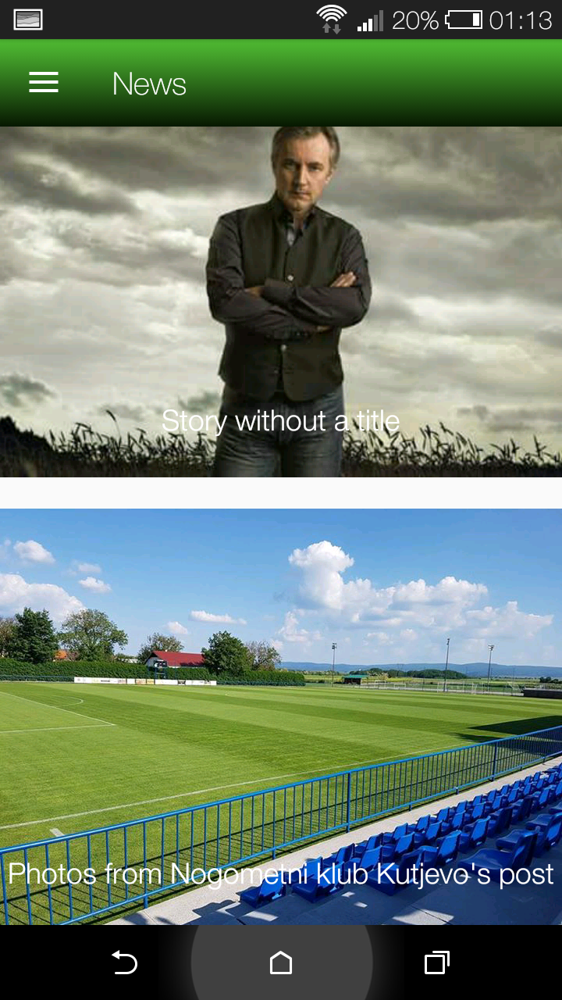
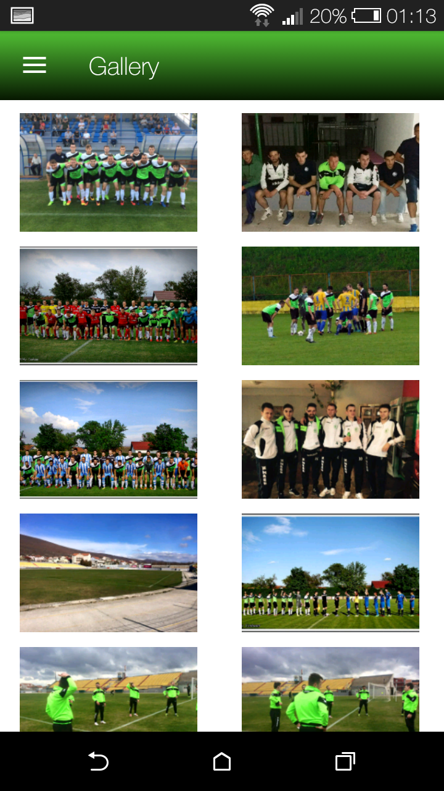
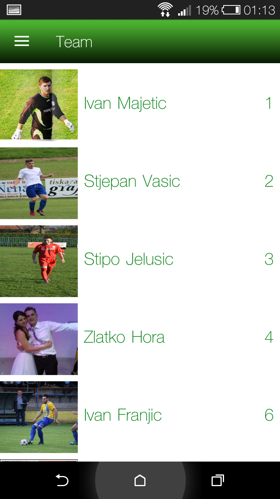
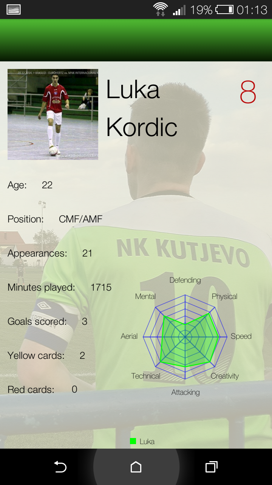
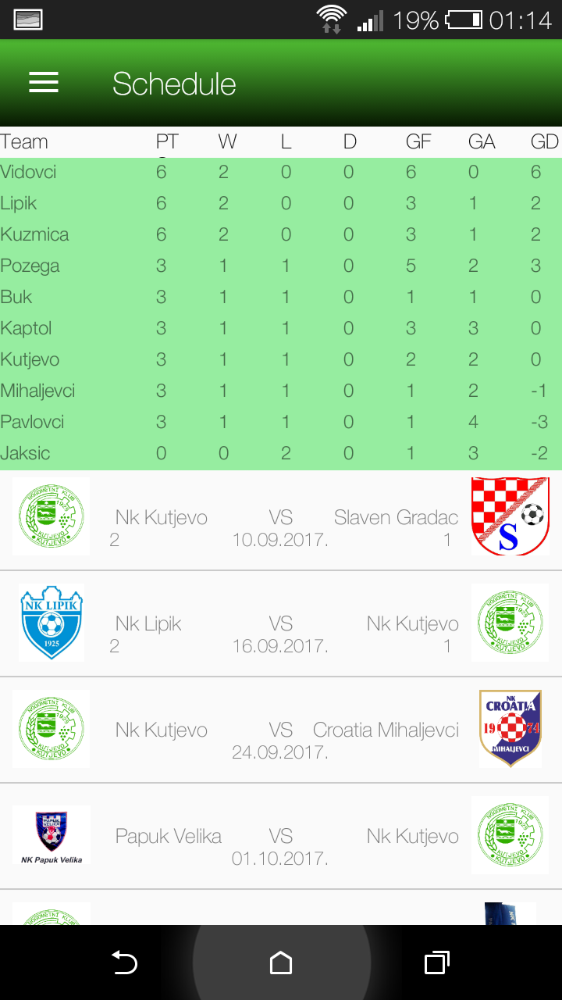
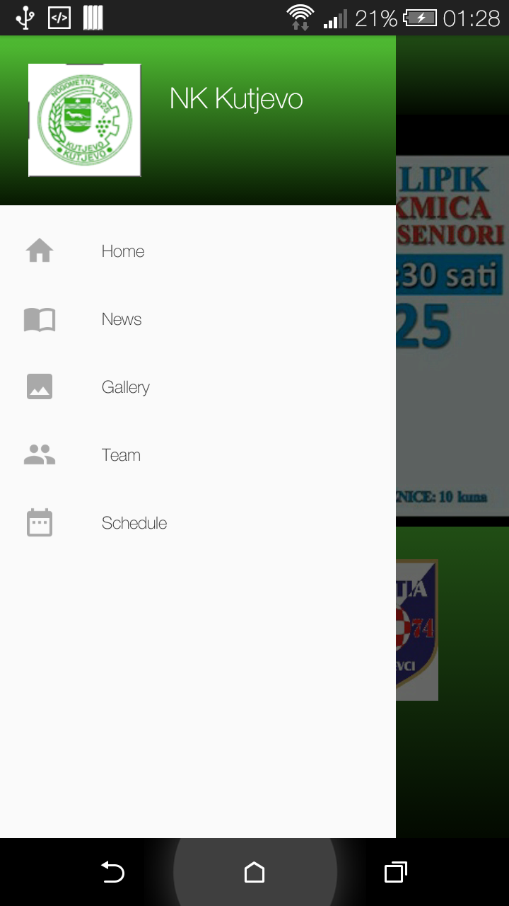

# NK-Kutjevo
## Android app developed as a project for "Development of mobile applications" course.

The main purpose of this application is to show posts from club's facebook page, basic statistics for the players, date and time of the next game, results of previous games, a league table, and a photo gallery.  
To get access to the facebook page users have to be singed in using Facebook login. 

Data about games and teams is persisted in Firebase database, and info about players is saved into a local Realm database. 

 
 

 
 

